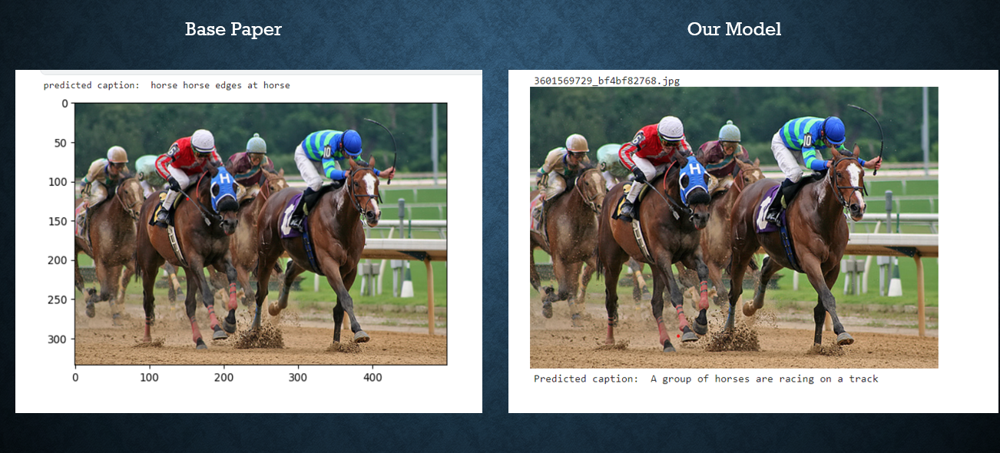
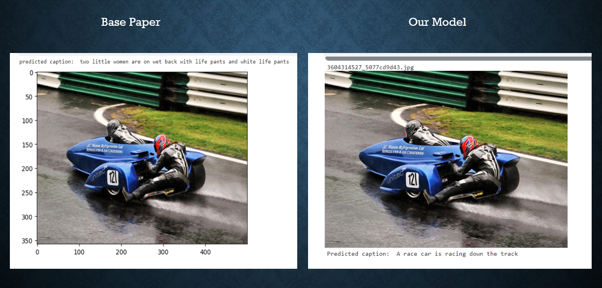

# Image Caption Generator

Image Caption Generator is a machine learning project where we have used Vision Transformer (ViT) to extract features and GPT-2 to generate captions. Transformer models do not have the problem of losing earlier context while processing long sequences. Therefore, it improves the quality of the image captions. More theoretical details can be found in the presentation slide and workings in the notebook.

# Project Architecture

# Workflow Overview

1. **Input Image Reading**: The input image is read using the `Image` function of the PIL (Python Imaging Library) library.

2. **Image Transformation with ViT**: The image is transformed using ViT (Vision Transformer).

3. **Feature Extraction**: The transformed image is passed through the feature extractor to extract the pixel values.

4. **Caption Tokenization and Padding**: Captions are tokenized and padded to the maximum length.

5. **Fine-Tuning GPT-2 Model**: The GPT-2 model is fine-tuned to generate captions.

6. **Evaluation with BLEU Score**: The BLEU score metric is used to evaluate the quality of the generated captions.

# Output Analysis

# Developers

This project is developed by:

1. **Azizur Rahman Anik**
   - Student ID: 1805115
   - Department of CSE, BUET

2. **K.M Fahim Shahriyar**
   - Student ID: 1805113
   - Department of CSE, BUET
